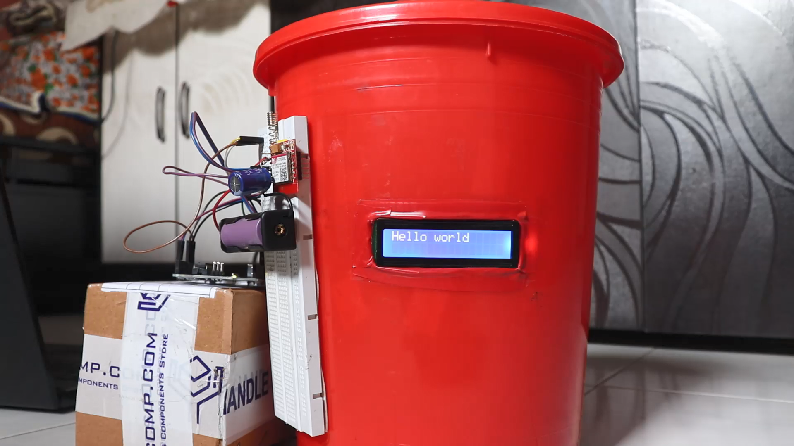

# Smart-Dustbin

Hello Developer

Smart dustbin based on IOT technology , Our system includes bins that have sensors which detect the garbage level in Real Time. Once the garbage will reach to its maximum limit (For our system we have taken the threshold as 90%) the bins will send alert messages along with location to the garbage collection team. The team will then reply with the time required to come and clean the bin, which will be displayed on the LCD display fitted on the bin. Once the bins will be cleaned the LCD will display “bins are cleaned”. And if the bins are not cleaned before the timer exceeds a compliant would be send to the higher authority.

Thank you!

Star⭐ the repo if you like what you see

Images are from Project
## 📸 ScreenShots

|------|
||
|------|

## ✨ Requirements
* Any Operating System (ie. MacOS X, Linux, Windows)
* Arduino IDE 
* Arduino UNO
* LCD screen
* GSM Module 800L
* Lithium Battery 
* Ultra sonic sensor
* Bread Board x 2
* A little knowledge of Arduino 
* A brain to think 🤓

## 🤓 Author
* Email : nihalpadwal@gmail.com

## Getting Started

This project is a uses Arduino 

Arduino is an open-source hardware and software company, project and user community that designs and 
manufactures single-board microcontrollers and microcontroller kits for building digital devices.

## LICENCE
 MIT License

Copyright (c) 2021 Nihal Padwal

Permission is hereby granted, free of charge, to any person obtaining a copy
of this software and associated documentation files (the "Software"), to deal
in the Software without restriction, including without limitation the rights
to use, copy, modify, merge, publish, distribute, sublicense, and/or sell
copies of the Software, and to permit persons to whom the Software is
furnished to do so, subject to the following conditions:

The above copyright notice and this permission notice shall be included in all
copies or substantial portions of the Software.

THE SOFTWARE IS PROVIDED "AS IS", WITHOUT WARRANTY OF ANY KIND, EXPRESS OR
IMPLIED, INCLUDING BUT NOT LIMITED TO THE WARRANTIES OF MERCHANTABILITY,
FITNESS FOR A PARTICULAR PURPOSE AND NONINFRINGEMENT. IN NO EVENT SHALL THE
AUTHORS OR COPYRIGHT HOLDERS BE LIABLE FOR ANY CLAIM, DAMAGES OR OTHER
LIABILITY, WHETHER IN AN ACTION OF CONTRACT, TORT OR OTHERWISE, ARISING FROM,
OUT OF OR IN CONNECTION WITH THE SOFTWARE OR THE USE OR OTHER DEALINGS IN THE
SOFTWARE.

